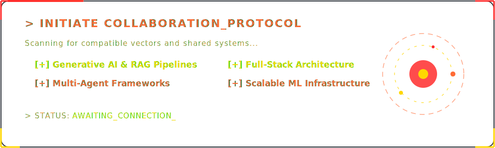

<div align="center">
  
</div>

<div align="center">
  <a href="https://git.io/typing-svg"></a>
</div>

<div align="center">
  
</div>

<br/>

<div align="center">
  <a href="https://www.linkedin.com/in/harsh-pariya/"></a>&nbsp;
  <a href="mailto:harshpariya195@gmail.com"></a>&nbsp;
  <a href="https://aiml-folio-alpha.vercel.app"></a>
</div>

<br/>

<div align="center">
  
</div>

## 「 🚀 About Me 」

```javascript
const harsh = {
    alias:    "HarshPariya",
    role:     "AI / ML Engineer",
    degree:   "B.Tech CSE, Rai University",
    focus:    ["Machine Learning", "Generative AI", "Computer Vision", "NLP"],
    building: "AI Career & Research Assistant",
    learning: ["Agentic AI Systems", "RAG Pipelines", "Advanced LLMs"],
    funFact:  "Great AI is not about bigger models. It's about solving real problems."
};
```

- 🔥 Currently building **AI Career & Research Assistant**
- 🤖 Exploring **Agentic Search, Voice AI, Vision AI & RAG**
- 📱 Building **Production-Ready Intelligent Systems**
- ⚡ Ask me about **Machine Learning, Generative AI, Computer Vision**

<br clear="both"/>

<div align="center">
  
</div>

## 「 ⚒️ Tech Stack 」

<table border="0" cellspacing="12" cellpadding="0" align="center">
<tr>

<td width="420" valign="top" align="center">

<h3>🤖 Machine Learning &amp; DL</h3>
<br>

<table align="center" cellspacing="0" cellpadding="10">
  <tr>
    <td align="center"><br/><sub><b>Python</b></sub></td>
    <td align="center"><br/><sub><b>Scikit-Learn</b></sub></td>
    <td align="center"><br/><sub><b>Pandas</b></sub></td>
    <td align="center"><br/><sub><b>Numpy</b></sub></td>
  </tr>
  <tr>
    <td align="center"><br/><sub><b>Regression</b></sub></td>
    <td align="center"><br/><sub><b>Classification</b></sub></td>
    <td align="center"><br/><sub><b>Clustering</b></sub></td>
    <td align="center"><br/><sub><b>Ensemble Models</b></sub></td>
  </tr>
  <tr>
    <td align="center"><br/><sub><b>TensorFlow</b></sub></td>
    <td align="center"><br/><sub><b>PyTorch</b></sub></td>
    <td align="center"><br/><sub><b>Keras</b></sub></td>
    <td align="center"><br/><sub><b>CNN</b></sub></td>
  </tr>
  <tr>
    <td align="center"><br/><sub><b>RNN</b></sub></td>
    <td align="center"><br/><sub><b>LSTM</b></sub></td>
    <td align="center"><br/><sub><b>Transfer Learning</b></sub></td>
    <td align="center"></td>
  </tr>
</table>

</td>

<td width="420" valign="top" align="center">

<h3>🚀 NLP &amp; Generative AI</h3>
<br>

<table align="center" cellspacing="0" cellpadding="10">
  <tr>
    <td align="center"><br/><sub><b>NLP</b></sub></td>
    <td align="center"><br/><sub><b>TF-IDF</b></sub></td>
    <td align="center"><br/><sub><b>NLTK</b></sub></td>
    <td align="center"><br/><sub><b>spaCy</b></sub></td>
  </tr>
  <tr>
    <td align="center"><br/><sub><b>Text Classification</b></sub></td>
    <td align="center"><br/><sub><b>Sentiment Analysis</b></sub></td>
    <td align="center"><br/><sub><b>OpenAI</b></sub></td>
    <td align="center"><br/><sub><b>Groq</b></sub></td>
  </tr>
  <tr>
    <td align="center"><br/><sub><b>LangChain</b></sub></td>
    <td align="center"><br/><sub><b>RAG</b></sub></td>
    <td align="center"><br/><sub><b>FAISS</b></sub></td>
    <td align="center"><br/><sub><b>Agentic AI</b></sub></td>
  </tr>
  <tr>
    <td align="center" colspan="4"><br/><sub><b>Prompt Engineering</b></sub></td>
  </tr>
</table>

</td>

</tr>

<tr>

<td width="420" valign="top" align="center">

<h3>🌐 Frontend</h3>
<br>

<table align="center" cellspacing="0" cellpadding="10">
  <tr>
    <td align="center"><br/><sub><b>React</b></sub></td>
    <td align="center"><br/><sub><b>Next.js</b></sub></td>
    <td align="center"><br/><sub><b>TypeScript</b></sub></td>
    <td align="center"><br/><sub><b>JavaScript</b></sub></td>
  </tr>
  <tr>
    <td align="center"><br/><sub><b>TailwindCSS</b></sub></td>
    <td align="center"><br/><sub><b>HTML5</b></sub></td>
    <td align="center"><br/><sub><b>CSS3</b></sub></td>
    <td align="center"></td>
  </tr>
</table>

</td>

<td width="420" valign="top" align="center">

<h3>⚙️ Backend</h3>
<br>

<table align="center" cellspacing="0" cellpadding="10">
  <tr>
    <td align="center"><br/><sub><b>Node.js</b></sub></td>
    <td align="center"><br/><sub><b>Express.js</b></sub></td>
    <td align="center"><br/><sub><b>FastAPI</b></sub></td>
    <td align="center"><br/><sub><b>MongoDB</b></sub></td>
  </tr>
  <tr>
    <td align="center" colspan="2"><br/><sub><b>JWT</b></sub></td>
    <td align="center" colspan="2"><br/><sub><b>REST API</b></sub></td>
  </tr>
</table>

</td>

</tr>

<tr>

<td colspan="2" valign="top" align="center">

<h3>☁️ DevOps & Tools</h3>
<br>

<table align="center" cellspacing="0" cellpadding="10">
  <tr>
    <td align="center"><br/><sub><b>Git</b></sub></td>
    <td align="center"><br/><sub><b>GitHub</b></sub></td>
    <td align="center"><br/><sub><b>Docker</b></sub></td>
    <td align="center"><br/><sub><b>Postman</b></sub></td>
    <td align="center"><br/><sub><b>Vercel</b></sub></td>
    <td align="center"><br/><sub><b>Render</b></sub></td>
    <td align="center"><br/><sub><b>Netlify</b></sub></td>
    <td align="center"><br/><sub><b>VS Code</b></sub></td>
  </tr>
</table>

</td>

</tr>
</table>

<div align="center">
  
</div>

## 「 🚀 Featured Projects & Showcase 」

<table width="100%" border="0" cellspacing="12" cellpadding="0">
<tr>
  <td width="33.3%" valign="top" align="center"><a href="https://aiml-folio-alpha.vercel.app/projects"></a></td>
  <td width="33.3%" valign="top" align="center"><a href="https://github.com/HarshPariya"></a></td>
  <td width="33.3%" valign="top" align="center"><a href="https://www.linkedin.com/in/harsh-pariya/"></a></td>
</tr>
</table>

<br>

<div align="center">

| Project | Highlights |
|----------|------------|
| 🧠 **AI Career & Research Assistant** | Agentic AI • RAG • Voice AI • ATS Resume Reviewer • [Demo](https://ai-assistant-gamma-sable.vercel.app/) • [Repo](https://github.com/HarshPariya/AI-Assistant-Frontend) |
| 🩺 **Brain Tumor Detection CNN** | TensorFlow • CNN • Medical Imaging • 86% Accuracy • [Demo](https://brain-tumor-detection-cnn.vercel.app/) • [Repo](https://github.com/HarshPariya/Brain-tumor-detection-cnn) |
| 📄 **Resume Screening AI** | XGBoost • NLP • TF-IDF • 88% Accuracy • [Demo](https://resume-screening-ai-01.streamlit.app/) • [Repo](https://github.com/HarshPariya/Resume_Screening_AI) |
| 📰 **Fake News Detection NLP** | Linear SVM • NLP • 99% Accuracy • [Demo](https://fake-news-detection-nlp-01.streamlit.app) • [Repo](https://github.com/HarshPariya/fake-news-detection-nlp) |
| 🏠 **California House Price Prediction** | XGBoost • FastAPI • Next.js • [Demo](https://california-house-price-prediction-g4vbqt29g.vercel.app) • [Repo](https://github.com/HarshPariya/California-House-Price-Prediction) |
| 🖼️ **Image Caption Generator** | CNN • LSTM • TensorFlow • Computer Vision • [Demo](https://image-caption-generator-01.streamlit.app/) • [Repo](https://github.com/HarshPariya/Image_Caption_Generator) |

</div>

<p align="center"> <a href="https://aiml-folio-alpha.vercel.app/projects"> 🚀 View All Projects </a> </p>

<div align="center">
  
</div>

## 「 📊 GitHub Stats 」

<div align="center">
  
</div>

<br/>

<div align="center">
  
</div>

<div align="center">
  
</div>

<div align="center">
  <br/>
  <p><b>-&gt; 🐍 Play my <a href="https://harshpariya.github.io/snake-game/">Snake Game</a> - Built with JavaScript &amp; Canvas</b></p>
  <br/>
</div>
<div align="center">
  <a href="https://aiml-folio-alpha.vercel.app"></a>
</div>

<br/>

<div align="center">
  <a href="https://aiml-folio-alpha.vercel.app"></a>&nbsp;&nbsp;
  <a href="mailto:harshpariya195@gmail.com"></a>&nbsp;&nbsp;
  <a href="https://www.linkedin.com/in/harsh-pariya/"></a>
</div>

<div align="center">
  
</div>